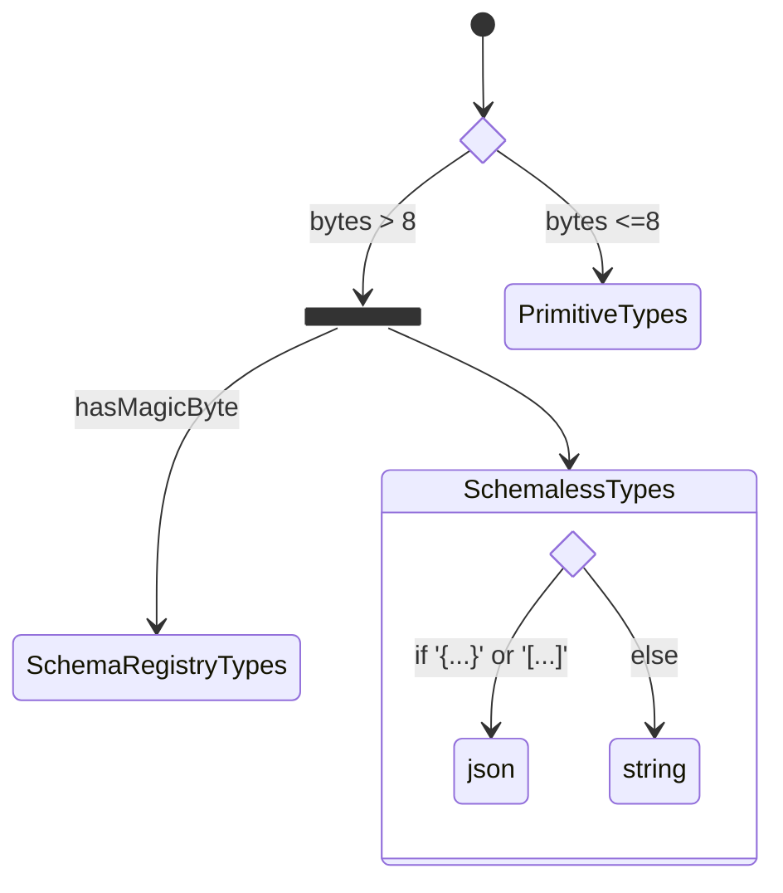

# Data Stream Smart Serializer / Deserializer

## Overview
This repository contains the smart serializer and deserializer for kafka connectors.

The smart serializer and deserializer allows for engineers to create consumers and producers without knowing the
underlying stream contents.

If a low dependency model is required is it recommended to review usage of required serializer and deserializer libraries as outlined [here](https://docs.confluent.io/platform/current/schema-registry/fundamentals/serdes-develop/index.html); as this repository includes all serializers and deserializers by default.

## Table Of Content

- [Installation](#Installation)
- [Supported data types](#Supported-data-types)

## Installation

### Maven

Deserializer
```xml
<dependency>
    <groupId>io.confluent</groupId>
    <artifactId>data-stream-composer-deserializer</artifactId>
    <version>${data-stream-composer-ser-des.version}</version>
</dependency>
```

Serializer
```xml
<dependency>
    <groupId>io.confluent</groupId>
    <artifactId>data-stream-composer-serializer</artifactId>
    <version>${data-stream-composer-ser-des.version}</version>
</dependency>
```

Common (Schema Registry Client Config and Utils)
```xml
 <dependency>
    <groupId>io.confluent</groupId>
    <artifactId>data-stream-composer-ser-des-common</artifactId>
    <version>${data-stream-composer-ser-des.version}</version>
</dependency>
```
### Producer

Kafka Producer Initialization

```Java
    KafkaProducer<K, V> producer=new KafkaProducer<>(properties,
        new ConfluentSerializer<>(properties,true),
        new ConfluentSerializer<>(properties,false));
```
### Consumer
Kafka Producer Initialization
```java
 try(KafkaConsumer<K, V> consumer=new KafkaConsumer<>(
        properties,
        new ConfluentDeserializer<>(properties,true,kClass),
        new ConfluentDeserializer<V>(properties,false,vClass))){
 ```

## Supported data types

| Primitive Types | Serializer Docs                                                                                                                                   | Deserializer Docs                                                                                                                                     |
|-----------------|---------------------------------------------------------------------------------------------------------------------------------------------------|-------------------------------------------------------------------------------------------------------------------------------------------------------|
| String          | [Serializer](https://docs.confluent.io/platform/current/clients/javadocs/javadoc/org/apache/kafka/common/serialization/StringSerializer.html)     | [Deserializer](https://docs.confluent.io/platform/current/clients/javadocs/javadoc/org/apache/kafka/common/serialization/StringDeserializer.html)     |
| Boolean         | [Serializer](https://docs.confluent.io/platform/current/clients/javadocs/javadoc/org/apache/kafka/common/serialization/BooleanSerializer.html)    | [Deserializer](https://docs.confluent.io/platform/current/clients/javadocs/javadoc/org/apache/kafka/common/serialization/BooleanDeserializer.html)    |
| Float           | [Serializer](https://docs.confluent.io/platform/current/clients/javadocs/javadoc/org/apache/kafka/common/serialization/FloatSerializer.html)      | [Deserializer](https://docs.confluent.io/platform/current/clients/javadocs/javadoc/org/apache/kafka/common/serialization/FloatDeserializer.html)      |
| Double          | [Serializer](https://docs.confluent.io/platform/current/clients/javadocs/javadoc/org/apache/kafka/common/serialization/DoubleSerializer.html)     | [Deserializer](https://docs.confluent.io/platform/current/clients/javadocs/javadoc/org/apache/kafka/common/serialization/DoubleDeserializer.html)     |
| Integer         | [Serializer](https://docs.confluent.io/platform/current/clients/javadocs/javadoc/org/apache/kafka/common/serialization/IntegerSerializer.html)    | [Deserializer](https://docs.confluent.io/platform/current/clients/javadocs/javadoc/org/apache/kafka/common/serialization/IntegerDeserializer.html)    |
| Long            | [Serializer](https://docs.confluent.io/platform/current/clients/javadocs/javadoc/org/apache/kafka/common/serialization/LongSerializer.html)       | [Deserializer](https://docs.confluent.io/platform/current/clients/javadocs/javadoc/org/apache/kafka/common/serialization/LongDeserializer.html)       |
| Short           | [Serializer](https://docs.confluent.io/platform/current/clients/javadocs/javadoc/org/apache/kafka/common/serialization/ShortSerializer.html)      | [Deserializer](https://docs.confluent.io/platform/current/clients/javadocs/javadoc/org/apache/kafka/common/serialization/ShortDeserializer.html)      |
| Bytes           | [Serializer](https://docs.confluent.io/platform/current/clients/javadocs/javadoc/org/apache/kafka/common/serialization/BytesSerializer.html)      | [Deserializer](https://docs.confluent.io/platform/current/clients/javadocs/javadoc/org/apache/kafka/common/serialization/BytesDeserializer.html)      |
| ByteArray       | [Serializer](https://docs.confluent.io/platform/current/clients/javadocs/javadoc/org/apache/kafka/common/serialization/ByteArraySerializer.html)  | [Deserializer](https://docs.confluent.io/platform/current/clients/javadocs/javadoc/org/apache/kafka/common/serialization/ByteArrayDeserializer.html)  |
| ByteBuffer      | [Serializer](https://docs.confluent.io/platform/current/clients/javadocs/javadoc/org/apache/kafka/common/serialization/ByteBufferSerializer.html) | [Deserializer](https://docs.confluent.io/platform/current/clients/javadocs/javadoc/org/apache/kafka/common/serialization/ByteBufferDeserializer.html) |
| UUID            | [Serializer](https://docs.confluent.io/platform/current/clients/javadocs/javadoc/org/apache/kafka/common/serialization/UUIDSerializer.html)       | [Deserializer](https://docs.confluent.io/platform/current/clients/javadocs/javadoc/org/apache/kafka/common/serialization/UUIDDeserializer.html)       |

| Schemaless Types| Serializer Docs | Deserializer Docs |
|-----------------|-----------------|-------------------|
| KafkaJSON      | [Serializer](https://github.com/confluentinc/schema-registry/blob/master/json-serializer/src/main/java/io/confluent/kafka/serializers/KafkaJsonSerializer.java) | [Deserializer](https://github.com/confluentinc/schema-registry/blob/master/json-serializer/src/main/java/io/confluent/kafka/serializers/KafkaJsonDeserializer.java) |

| Schema Types   | Serializer Docs | Deserializer Docs |
|----------------|------------|--------------|
| KafkaAvro      | [Serializer](https://docs.confluent.io/platform/current/schema-registry/serdes-develop/serdes-avro.html#avro-serializer)        | [Deserializer](https://docs.confluent.io/platform/current/schema-registry/serdes-develop/serdes-avro.html#avro-deserializer)    |
| KafkaJSONSchema| [Serializer](https://docs.confluent.io/platform/current/schema-registry/serdes-develop/serdes-json.html#json-schema-serializer) | [Deserializer](https://docs.confluent.io/platform/current/schema-registry/serdes-develop/serdes-json.html#json-schema-deserializer) |
| Protobuf       | [Serializer](https://docs.confluent.io/platform/current/schema-registry/serdes-develop/serdes-protobuf.html#protobuf-serializer) | [Deserializer](https://docs.confluent.io/platform/current/schema-registry/serdes-develop/serdes-protobuf.html#protobuf-deserializer) |

### SerializationTypes

The [`SerializationTypes.class`](common/src/main/java/confluent/client/common/SerializationTypes.java) is used to determine the type of data type that needs to be serialized/deserialized via a range of methods:

1. #### Headers
This method is used to determine the serialization type from the headers and compared against an Enum matching the data type via `valueOf`

2. #### String
This method is used to determine the serialization type from a string and compared against an Enum matching the data type via `valueOf`

3. #### Bytes
This method is used to determine the serialization type of the message via the comparison of bytes. (Primitives are checked first then Schema)

| Primitive Types  | Bytes Check                                                         |
|------------------|---------------------------------------------------------------------|
| String (Default) | `bytes.length == 0` (edge case of possible empty string "")         |
| Boolean          | `bytes.length == 1 && if (bytes[0] == 0x00 ` OR `bytes[0] == 0x01)` |
| ByteArray        | `bytes.length == 1`                                                 |
| Short            | `bytes.length == 2`                                                 | 
| Integer          | `bytes.length == 4`                                                 |
| Long             | `bytes.length == 8`                                                 |
|                  |                                                                     |

| Schemaless Types | Bytes Check                                                                                                     |
|------------------|-----------------------------------------------------------------------------------------------------------------|
| JSON             | `(bytes[0] == '{' && bytes[bytes.length - 1] == '}')` OR `(bytes[0] == '[' && bytes[bytes.length - 1] == ']'))` |

**Remaining Schema Types are compared in the Schema Check**

4. #### Schema
This method is used to determine the serialization type of the message via the use of the
Schema Registry supplier.

| Schema Types    | Schema Type |
|-----------------|-------------|
| Avro            | `AVRO`      |
| KafkaJSONSchema | `JSON`      |
| Protobuf        | `PROTOBUF`  |

5. #### Class

